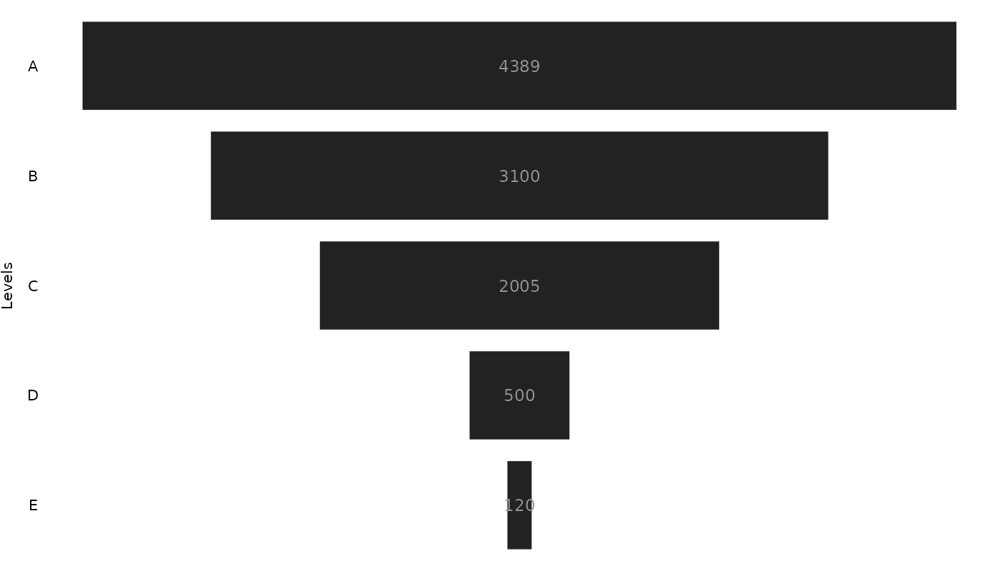

# `ggfunnel` 

## Overview

`{ggfunnel}` is a R package that uses `{ggplot2}` to create Power BI
# like funnel charts in R.


## A basic example of use

The main functionality of the package is available at the `ggfunnel::funnel()` function. It is responsible for producing the plot, and you usually define 3 arguments in this function, which are:

- `data`: the data.frame with the data you want to use in the plot;
- `values`: the column name where are the values you want to display in your funnel chart. In other words, the numerical data that you want to visualize in the chart;
- `levels`: the column name with the "levels" (or the "groups") you want to display in your funnel chart. In other words, the categorical data that identifies each level in the funnel;

Lets take the `ggfunnel::aggregates` data.frame as an example:

```r
ggfunnel::aggregates
```
```
# A tibble: 5 × 2
  Step  N_users
  <chr>   <dbl>
1 A        4389
2 B        3100
3 C        2005
4 D         500
5 E         120
```

In the example below, we are using the data stored at `ggfunnel::aggregates` to build a basic funnel chart. The `N_users` column is the column with numerical data, so I give it to the `values` argument of the function. This way, these values will be used to determine the widths of each rectangle in the funnel chart. 

In contrast, the `Step` column contains the categorical data of the dataset. That is why I gave this column to the `levels` argument of the function. As a result, the values of this column will be used to determine the "levels" of the funnel chart.

```r
library(ggfunnel)
plot <- ggfunnel::aggregates |>
  ggfunnel::funnel(
    values = N_users, levels = Step
  )

print(plot)
```



## A simple (but far from perfect) approach

`{ggfunnel}` is kind of a experimental package, and it is far from perfect. As a result, it does not contain all you might want/need for building a funnel chart. 

This means that, currently, `{ggfunnel}` gives you the minimal code necessary to produce a decent funnel chart. But it does give much more functionality than that. It also makes some assumptions about your data that might not hold, and it does not contain some features that you might find at Power BI (e.g. percentage labels).

But, even being a very simple package, `ggfunnel::funnel()` always returns the raw `ggplot` object that describes the funnel chart. This means that the package gives you a lot of freedom to customize (or to complement) the output in the way you might need (see `vignette("funnel")` for more details on how to customize/complement the `ggfunnel::funnel()` output).

However, the package needs some work to be a more robust and complete piece of code, for sure. If you think you can make `{ggfunnel}` better I would be happy to review a PR from you!

